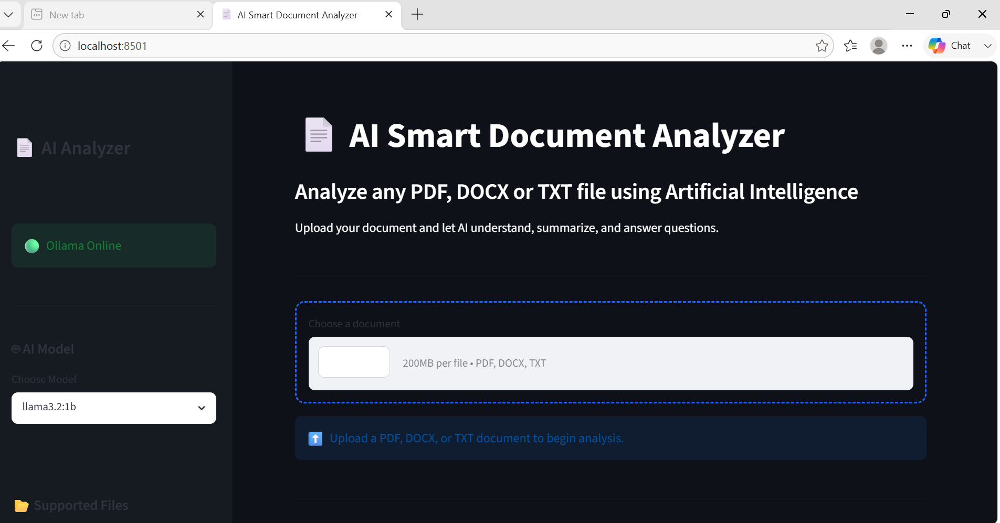
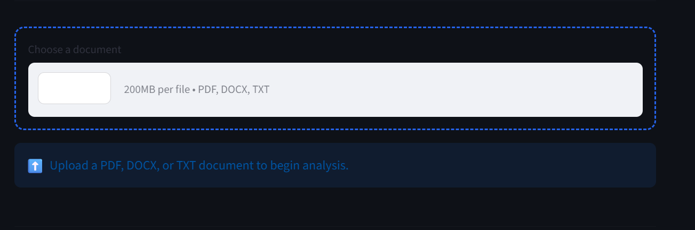
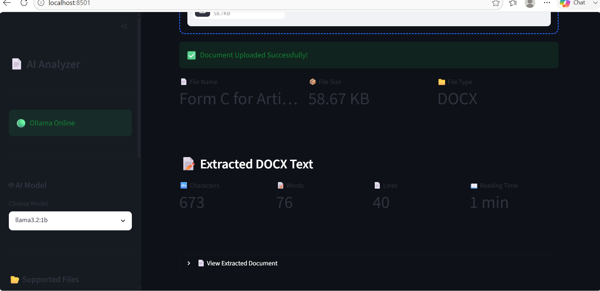
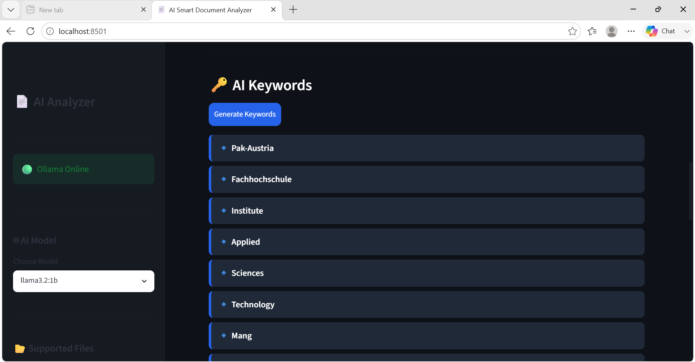
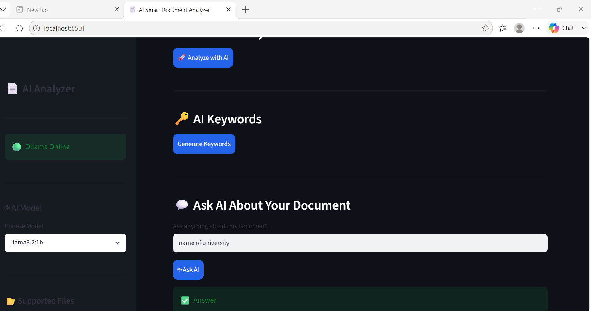

# 📄 Smart AI  Document Analyzer

🤖 **Analyze PDF, DOCX, and TXT documents using Local AI with Python, Streamlit, and Ollama**

---

## 📌 Project Overview

AI Smart Document Analyzer is a local AI-powered web application built with **Python**, **Streamlit**, and **Ollama**. It enables users to upload PDF, DOCX, and TXT documents, extract their text, generate AI-powered summaries, identify important keywords, and ask questions about the uploaded content.

Unlike cloud-based AI services, this application runs entirely on your local machine using **Ollama**, helping keep your documents private.

---

## ✨ Features

| Feature | Description |
|---------|-------------|
| 📄 Multiple File Support | Upload PDF, DOCX, and TXT files |
| 📖 Text Extraction | Extracts text from uploaded documents |
| 📊 Document Statistics | Displays word count, character count, and reading time |
| 🤖 AI Summary | Generates a concise document summary |
| 📌 Important Points | Highlights key information |
| 🎯 Main Topic Detection | Identifies the document's main topic |
| 🔑 Keyword Extraction | Extracts important keywords |
| 💬 Ask AI | Ask questions about the uploaded document |
| 📥 Download Report | Download the AI-generated analysis |
| 🔒 Local AI | Runs completely offline with Ollama |

---

# 🖥️ Application Preview

## 🏠 Home Page



---

## 📂 Upload Document



---

## 🤖 AI Summary



---

## 🔑 Keywords



---

## 💬 Ask AI



---

# 🚀 How It Works

```
Upload Document
      │
      ▼
Extract Text
      │
      ▼
Calculate Statistics
      │
      ▼
Send Prompt to Ollama
      │
      ▼
Generate AI Response
      │
      ▼
Display Summary & Keywords
      │
      ▼
Answer User Questions
```

---

# 🧠 AI Capabilities

The application can perform:

- 📄 Document Summarization
- 📌 Important Point Extraction
- 🎯 Topic Identification
- 🔑 Keyword Extraction
- 💬 Question Answering
- 📊 Document Statistics
- 📥 AI Report Generation

---

# 📂 Project Structure

```
AI-Smart-Document-Analyzer/
│
├── assets/
│   └── banner.png
│
├── reports/
│
├── screenshots/
│   ├── home.png
│   ├── upload.png
│   ├── summary.png
│   ├── keywords.png
│   └── ask_ai.png
│
├── app.py
├── analyzer.py
├── prompt.py
├── pdf_reader.py
├── docx_reader.py
├── txt_reader.py
├── requirements.txt
├── README.md
└── .gitignore
```

---

# ⚙️ Installation

## 1️⃣ Clone the Repository

```bash
git clone https://github.com/YOUR_USERNAME/AI-Smart-Document-Analyzer.git
```

Move into the project folder:

```bash
cd AI-Smart-Document-Analyzer
```

---

## 2️⃣ Create a Virtual Environment

### Windows

```bash
python -m venv .venv
.venv\Scripts\activate
```

### Linux / macOS

```bash
python3 -m venv .venv
source .venv/bin/activate
```

---

## 3️⃣ Install Dependencies

```bash
pip install -r requirements.txt
```

---

# 🦙 Install Ollama

Download Ollama:

https://ollama.com/download

Verify installation:

```bash
ollama --version
```

---

# 📥 Download AI Model

```bash
ollama pull llama3.2:1b
```

You can also use:

- llama3.2
- llama3.1
- mistral
- gemma
- phi3

---

# ▶️ Start Ollama

```bash
ollama serve
```

---

# 🚀 Run the Application

```bash
python -m streamlit run app.py
```

Default URL:

```
http://localhost:8501
```

---

# 📋 Supported File Types

| File Type | Supported |
|-----------|-----------|
| PDF | ✅ |
| DOCX | ✅ |
| TXT | ✅ |

---

# 💻 Technologies Used

| Technology | Purpose |
|------------|---------|
| Python | Backend Development |
| Streamlit | User Interface |
| Ollama | Local AI Model |
| Requests | API Communication |
| PyPDF2 | PDF Reader |
| python-docx | DOCX Reader |

---

# 🔥 Project Highlights

- ✅ Offline AI Processing
- ✅ Privacy-Friendly
- ✅ AI-Powered Summaries
- ✅ Keyword Extraction
- ✅ Question Answering
- ✅ Multiple Document Support
- ✅ Interactive Streamlit Interface
- ✅ Downloadable Reports

---

# 🔮 Future Improvements

- 🌍 Multi-language support
- 📑 PPTX and Excel support
- 🖼 OCR for scanned PDFs
- 📊 Visual analytics dashboard
- ☁ Cloud deployment
- 🔍 Semantic search
- 👤 User authentication

---

# 🤝 Contributing

Contributions are welcome!

1. Fork the repository
2. Create a feature branch
3. Commit your changes
4. Open a Pull Request

---

# 📄 License

This project is licensed under the **MIT License**.

---

# 👩‍💻 Author

**Hadia Awan**

BS Artificial Intelligence Student

---

# ⭐ Support

If you found this project useful, please consider giving it a **⭐ Star** on GitHub.

It helps support future AI and open-source projects.

---

**Made with ❤️ using Python, Streamlit, and Ollama**
